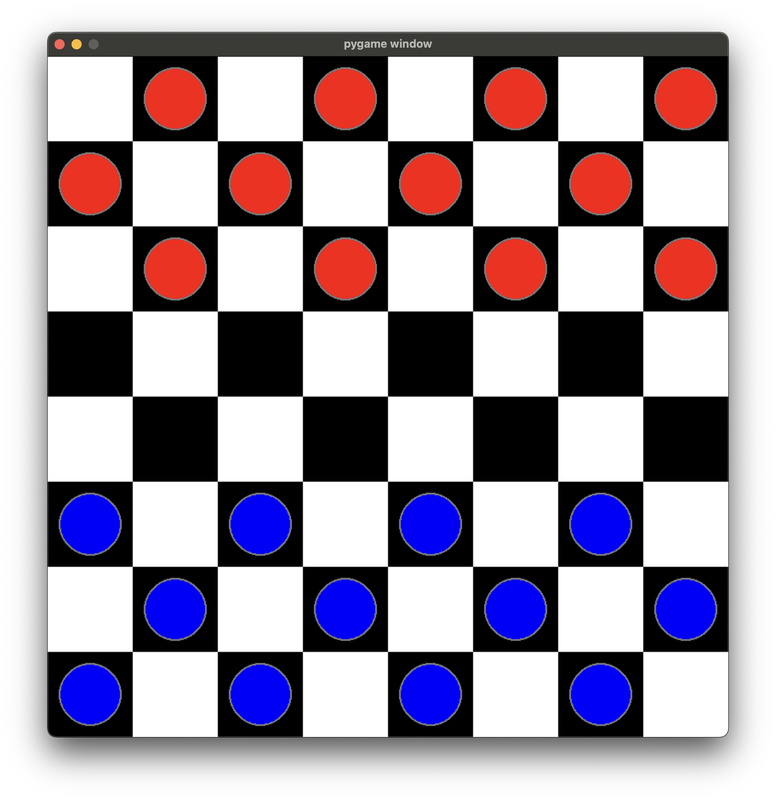
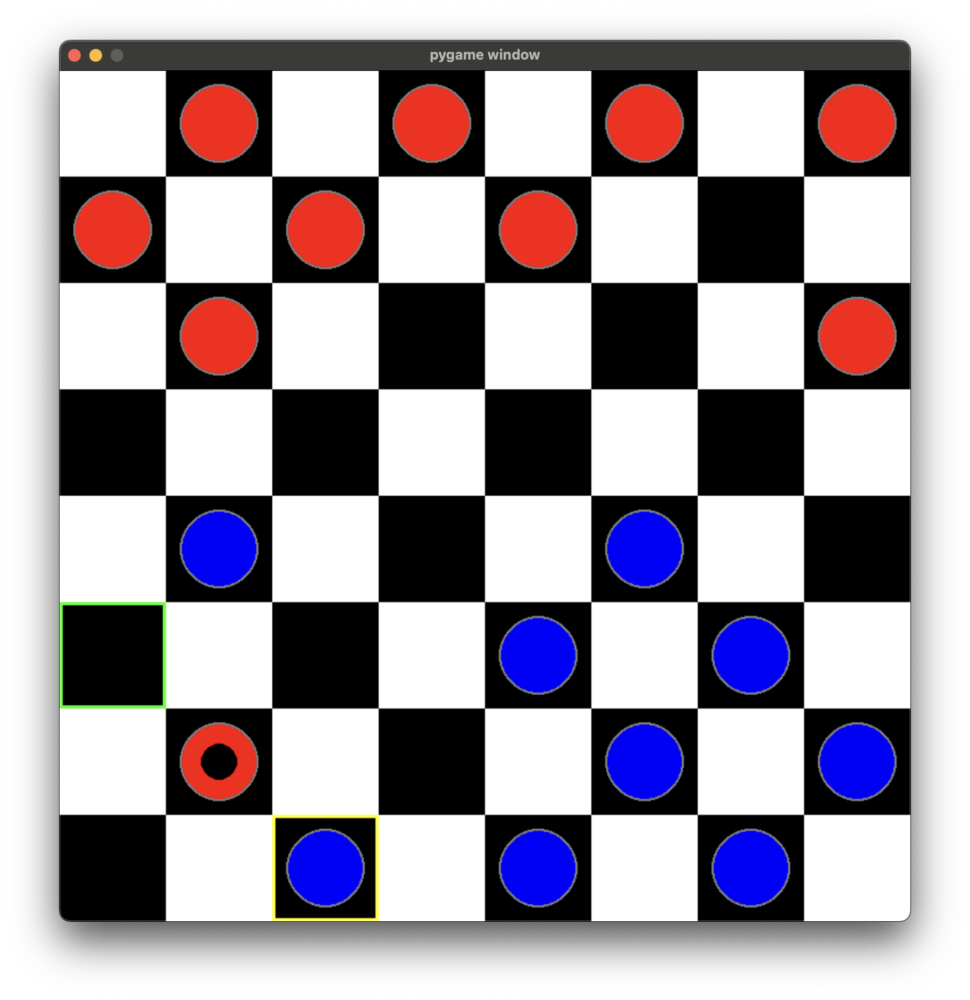

# This is a checker game made with pygame

## Usage

1.  `git clone`

2.  `python3 main.py`

**Note:** Press `z` to undo move.

## Rules are simple

### Objective:

- Capture all of the opponent's pieces or block them so they cannot make a move.

### Movement:

- Pieces can only move diagonally on dark square

- Pieces can only move forward. Once they become "King" by the last row of opponent side they can move freely diagonally.

### Capturing:

- Capture an opponent's piece by jumping over it to an empty square directly beyond it.

- Multiple captures are allowed in a single turn (multi-jump) if possible

### Additional Rules:

- If a player can make a capture, they must do so (forced capture rule). -- WHAT MAKES THIS GAME FUN!!!!

- The game can end in a stalemate if neither player can make a legal move.

---

"Start of a game"

"A piece with a black dot indicates a King"

